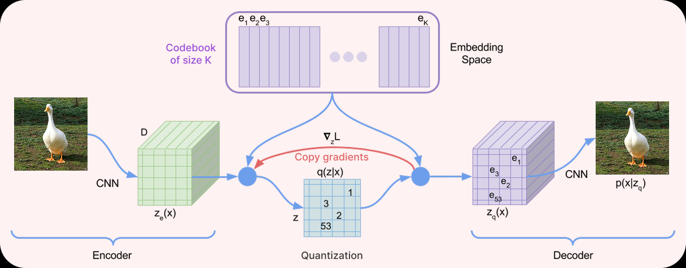
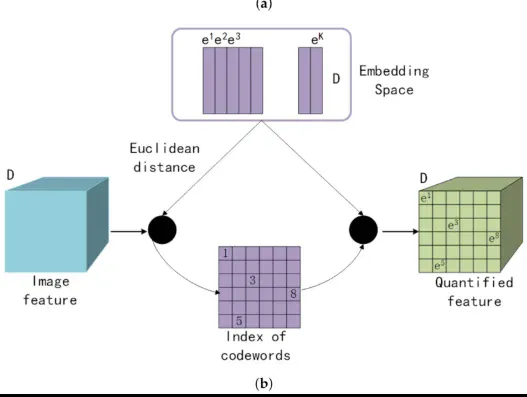
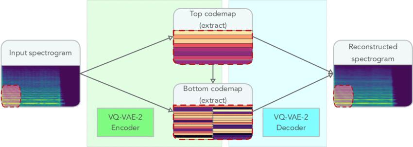
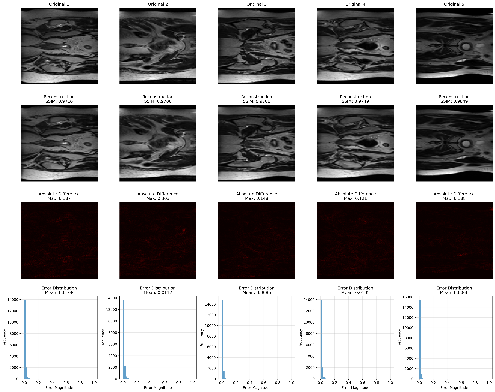
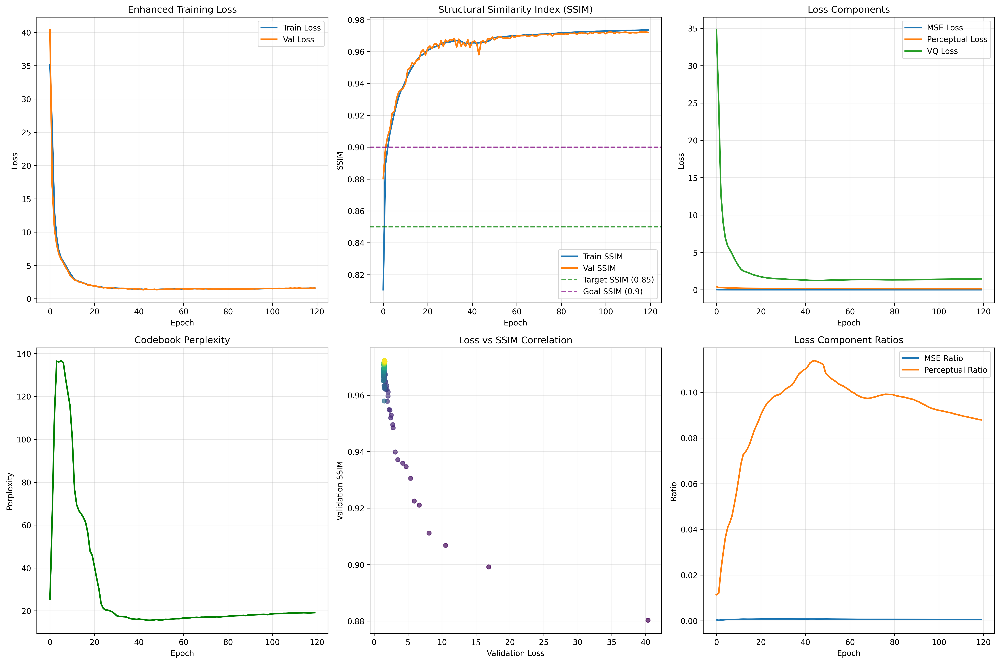
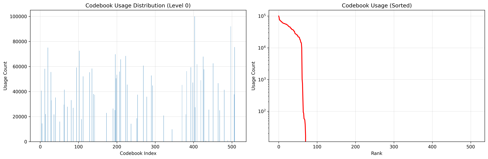
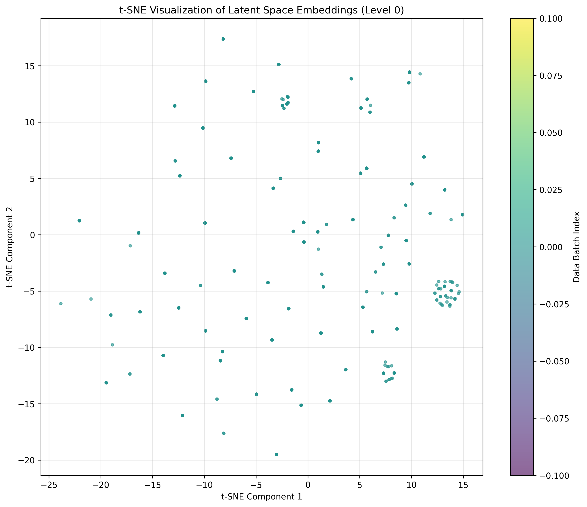

# High-Fidelity 2D Hip MRI Reconstruction for Prostate Cancer Using VQ-VAE 2

## Table of Contents

* [Overview](#overview)
* [Problem Description](#problem-description)
* [Theory & Working Principles](#theory--working-principles)

  * [Architecture Pipeline](#architecture-pipeline)
  * [Component Breakdown](#component-breakdown)
    * [Hierarchical Encoder: Multi-Scale Feature Extraction](#1️-hierarchical-encoder-multi-scale-feature-extraction)
    * [Vector Quantization: From Continuous to Discrete](#2-vector-quantization-from-continuous-to-discrete)
    * [Hierarchical Multi-Resolution Processing](#3️-hierarchical-multi-resolution-processing)
    * [Enhanced Loss Function](#4️-enhanced-multi-objective-loss-function)
    * [Decoder](#5️-decoder-reconstruction-from-discrete-codes)
* [Why This Architecture Works](#why-this-architecture-works)
* [Project Structure](#project-structure)
* [Dependencies & Reproducibility](#dependencies--reproducibility)
* [Example Usage](#example-usage)
* [Results & Performance Analysis](#results--performance-analysis)
    * [Final Quantitative Results (Test Set)](#1-final-quantitative-results-test-set)
    * [Qualitative Reconstruction Quality](#2-qualitative-reconstruction-quality)
    * [Training Performance Summary](#3-training-performance-summary)
    * [Latent Space & Codebook Analysis (A Deeper Dive)](#4-latent-space--codebook-analysis-a-deeper-dive)
* [Data Preprocessing & Splits](#data-preprocessing-and-splits)

---

## Overview

This project implements an **Enhanced VQ-VAE 2 model** for high-fidelity reconstruction of 2D hip MRI scans. Standard autoencoders often produce blurry results, which is unacceptable for critical medical data. This model overcomes that by using hierarchical encoders to capture multi-scale features and vector quantization to learn a discrete "codebook" of features which prevents blur.

By combining a standard reconstruction loss with an advanced perceptual and SSIM loss function, the model is optimized for structural integrity, not just pixel-wise error. This approach proved highly successful, achieving near-lossless reconstructions with SSIM scores exceeding 0.97 (on validations as well as test set).

---

## Problem Description

The primary challenge in generative image compression is **mode collapse**, which in standard autoencoders often manifests as **blurry reconstructions**. This occurs because a continuous latent space encourages the model to *average* data points, smoothing over critical,high-frequency details.

This is a critical failure in medical imaging, where:
* The loss of **sharp edges** (e.g., bone-to-tissue boundaries) is unacceptable.
* The blurring of **fine textures** can obscure diagnostic information.
* The model must preserve both **global anatomical structure** (e.g., the shape of the femur) and **local tissue patterns** simultaneously.

This project implements an **Enhanced VQ-VAE 2** because its architecture is specifically designed to solve these exact problems:

1.   **It solves "blurriness"** by using a **discrete, Vector-Quantized (VQ) codebook**. Instead of a continuous space, the model must choose from a finite "vocabulary" of prototype vectors. This forces the model to make a hard, "committed" choice, preserving sharpness instead of averaging. 
2.   **It solves the "global vs. local" problem** by being **hierarchical**. The model encodes the image at multiple scales, capturing high-level global structures in its top-level latent map and fine-grained local textures in its bottom-level latent map.

So our goal is to create a generative model that can compress 2D hip MRI scans and then reconstruct them with near-perfect, non-blurry fidelity, achieving high quantitative metrics (specifically, a **Structural Similarity Index (SSIM) > 0.60**).

---
## Theory & Working Principles

As we know from our description, standard autoencoders suffer from a critical flaw wich is **they blur fine details**. This happens because continuous latent representations average over diverse inputs, destroying the high-frequency structures essential for medical imaging—sharp bone edges, subtle tissue textures, and precise anatomical boundaries.

Our **Vector Quantized Variational Autoencoder (VQ-VAE)** solves this through **discrete representation learning**, creating crystal-clear reconstructions by replacing continuous averaging with learned categorical prototypes.

---

### Architecture Pipeline



> *Figure 1: Complete VQ-VAE2 Architecture. The encoder compresses images into continuous features, vector quantization discretizes them into codebook indices, and the decoder reconstructs the image from these discrete codes. The gradient copying mechanism enables end-to-end training despite the non-differentiable quantization step.*

---

### Component Breakdown

### 1️. **Hierarchical Encoder: Multi-Scale Feature Extraction**

Our encoder uses a **two-stage hierarchical design** to capture both semantic meaning and fine details:

#### **Bottom-Up Encoder** (`BottomUpEncoder` in `modules.py`)
- **Input:** 128×128 MRI slice
- **Process:** Series of `Conv2d` layers with progressive downsampling
- **Output:** Multi-scale feature pyramid
  - 128×128 → 64×64 → 32×32 → ...
  - Early layers: edges, textures (low-level)
  - Deep layers: anatomical structures (high-level)

#### **Top-Down Encoder** (`TopDownEncoder` in `modules.py`)
- **Process:** Reverse flow from abstract to detailed
- **Key Mechanism:** Skip connections restore lost details
  ```python
  x = x + features[i + 1]  # Reintegrate fine-grained info
  ```
- **Output:** Refined feature maps (`top_down_features`) with both:
  - Global semantic context
  - Local structural details

At last we get information-rich continuous features ready for quantization.

---

### 2. Vector Quantization: From Continuous to Discrete

After the Hierarchical Encoder produces the continuous feature maps, they must be compressed. This is the job of the **Vector Quantizer**, which solves the "blurriness" problem by "snapping" these continuous features to a finite, learnable "vocabulary" of discrete vectors.

This entire process is illustrated in above Figure 2 and implemented in the `VectorQuantizer` class in `modules.py`.

<p align="center">
  
</p>

> *Figure 2: Vector Quantization Mechanism. Continuous encoder outputs are mapped to discrete codebook embeddings via nearest-neighbor search using Euclidean distance. The resulting indices form the compressed representation.*

#### **The Codebook: A Learned Vocabulary**
* **Size:** K = 512 prototype vectors (the "Embedding Space").
* **Dimension:** D = 256 (the `embedding_dim` of each vector).
* **Usage:** As our results show, only **71/512 vectors** were actively used, indicating the model learned a highly efficient, specialized vocabulary for this MRI dataset.

#### **Quantization Process**
For each "blurry" feature vector that the encoder produces, the `VectorQuantizer` performs these steps:

1.  **Compute Distances:** It compares that incoming vector to all 512 "prototype" vectors (our "crayons") stored in the **Codebook** to find the closest match.
2.  **Find Nearest Neighbor:** It finds the *index number* of the prototype vector that is the best fit (e.g., "crayon #403").
3.  **Create Codemap:** The 2D grid of these index numbers (like `[1, 3, 5]` or `[403, 112, 5]`) *is* the final **codemap**. This "paint-by-numbers" sheet is the true, highly compressed data.
4.  **Lookup Features:** It creates a new, "sharp" feature map by looking up each index number from the codemap and grabbing the corresponding prototype vector from the Codebook. This "sharp" map is the *only* data the decoder receives.

**Why This Works:**
* **No Averaging:** The model is forced to choose a *specific* prototype vector from the codebook. It cannot create a "blurry" average between two vectors. This results in sharp, precise features.
* **Extreme Compression:** The final codemap is just a small grid of integers (indices 0-511), which is vastly smaller than the original continuous feature maps.
* **Learned Prototypes:** The codebook vectors themselves are trained, so they become optimal "prototypes" for representing common patterns in MRI scans (e.g., "bone texture," "soft tissue").

#### **Training Through Non-Differentiability**

A major challenge is that the `argmin` (Find Nearest Neighbor) operation has no gradient, so it's not differentiable. This is solved with two mechanisms:

1.  **Straight-Through Estimator (STE):** We "copy" the gradients from the decoder straight back to the encoder, as shown by the red arrow in Figure 2. This allows the encoder to train *as if* the quantization step was just an identity function.
    * **In `modules.py`:** `quantized = inputs + (quantized - inputs).detach()`

2.  **Commitment Loss ($L_{vq}$):** We add a special loss to train the codebook and "commit" the encoder to its outputs. Our code implements this as two parts:
    * **Codebook Loss (`q_latent_loss`):** Updates the codebook vectors to move *towards* the encoder's output.
    * **Commitment Loss (`e_latent_loss`):** Updates the encoder's output to "commit" to the chosen codebook vector.
    * **In `modules.py`:** `loss = q_latent_loss + self.commitment_cost * e_latent_loss`

---

### 3️. Hierarchical Multi-Resolution Processing

A key feature of the VQ-VAE 2 architecture is that it processes information at multiple scales, as shown in the diagram. This allows the model to separate global structure from local details.

<p align="center">
  
</p>

> *Figure 3: Hierarchical VQ-VAE-2 Architecture. Top and bottom codemaps capture information at multiple scales: coarse semantic structures (top) and fine details (bottom). Both are combined during reconstruction.*

  * **Top Codemap (Global Structure):** This is the smallest, most compressed codemap (from `top_down_features[0]`). It holds the **global semantic information** (e.g., "this is the main bone structure").
  * **Bottom Codemap (Local Details):** This is the larger, more detailed codemap (from `top_down_features[1]`). It holds the **local texture information** (e.g., "this is a sharp edge").

**Crucially, the `Decoder` *only* uses the `Top Codemap` to reconstruct the image.**

This works because the `Bottom Codemap` is still used to calculate the total **VQ-Loss** during training. This forces the encoder to learn to preserve fine details at all scales, even if they aren't directly used by the decoder. This process makes the `Top Codemap` itself much richer and more descriptive, as it learns to implicitly contain all the information the decoder needs.

---

### 4️. **Enhanced Multi-Objective Loss Function**

Single MSE loss is **insufficient for medical images**. We combine four complementary objectives:

| Loss Component | Implementation | Purpose | Weight |
|----------------|----------------|---------|---------|
| **Reconstruction Loss** | `F.mse_loss(output, target)` | Pixel-level accuracy | λ_rec |
| **Perceptual Loss** | VGG16 feature matching | Natural textures & shapes | λ_perc |
| **SSIM Loss** | `1.0 - ssim(output, target)` | Structural similarity (luminance, contrast) | λ_ssim |
| **VQ Loss** | Commitment + codebook loss | Stable quantization training | 1.0 |

#### **Complete Loss Function**

$$
L_{\text{total}} = \lambda_{\text{rec}} L_{\text{rec}} + \lambda_{\text{perc}} L_{\text{perc}} + \lambda_{\text{ssim}} L_{\text{ssim}} + L_{\text{vq}}
$$

**Why Each Component Matters:**

- **$L_{\text{rec}}$:** Basic fidelity baseline
- **$L_{\text{perc}}$:** Forces perceptually natural images (uses pre-trained VGG16)
- **$L_{\text{ssim}}$:** Preserves diagnostic structural information
  - Luminance: Overall brightness
  - Contrast: Local intensity variations
  - Structure: Spatial patterns and edges
- **$L_{\text{vq}}$:** Stabilizes discrete representation learning

*See `calculate_enhanced_loss()` in modules.py for implementation.*

---

You're absolutely right! Here's the corrected section:

---

### 5️. Decoder: Reconstruction from Discrete Codes

**Architecture** (Implemented in `Decoder` class)

```
Input: Top-level quantized codemap (64×64×D)
  ↓
[ResidualBlock + Conv2d layers] → 64×64 (feature processing)
  ↓
[ConvTranspose2d] → 128×128 (single upsampling)
  ↓
Tanh Activation → [-1, 1] output range
```

**Key Design Choices:**
- **Residual Blocks:** Recover fine details lost during compression through skip connections
- **Conv2d Processing:** Refines the 64×64 quantized features before upsampling
- **ConvTranspose2d:** Single learnable upsampling layer (better than interpolation) that doubles spatial dimensions from 64×64 to 128×128
- **Tanh Output:** Matches preprocessed input range of [-1, 1], ensuring stable training

**Architecture Flow:**
1. Takes the top-level quantized codemap at 64×64 resolution
2. Processes it through residual blocks and convolutional layers to refine features while maintaining 64×64 spatial dimensions
3. Performs a single upsampling step to reach the target 128×128 output size
4. Applies Tanh activation to constrain output to the expected range

---

## Why This Architecture Works

| Challenge | Solution |
|-----------|----------|
| Blurry reconstructions | Discrete codebook prevents averaging |
| Lost fine details | Hierarchical encoder + skip connections |
| Training instability | Commitment loss + straight-through estimator |
| Poor perceptual quality | Multi-objective loss (MSE + perceptual + SSIM) |
| Information loss | Residual decoder blocks |

---

## Project Structure

| File         | Purpose                                                                 |
| ------------ | ----------------------------------------------------------------------- |
| `modules.py` | ResidualBlock, VectorQuantizer, Encoders, Decoder, EnhancedVQVAE2 model |
| `dataset.py` | MRI loading, preprocessing, and data loaders                            |
| `train.py`   | Training loop, checkpointing, plotting training history                 |
| `predict.py` | Evaluation on test set, SSIM/MSE metrics, visualizations                |
| `utils.py`   | Visualization and plotting helpers                                      |

---

## Dependencies & Reproducibility

### Required Python Libraries

This project requires the following Python libraries:

```text
torch >= 2.0
torchvision
numpy
matplotlib
scikit-learn
tqdm
nibabel
opencv-python
```

### Installation with `requirements.txt`

You can also install all required libraries at once using `pip` using our requirements.txt file:

```bash
# Install all required libraries
pip install -r requirements.txt
```

### Reproducibility

There are two ways to run this project:

1.  **Train from scratch:** Run `python train.py` (as shown below) to train the model from the beginning.
2.  **Run pre-trained evaluation:** Run `python predict.py`. This will load the included `final_model_complete_history.pth` checkpoint (Currently, not added because model files should not be included in the submission), run the final evaluation, and generate all analysis plots.

-----

## Example Usage

### 1\. Train the model:

The `train.py` script accepts command-line arguments. The most important is `--data_dir`.

```bash
# Example: Train for 120 epochs using the data in 'HipMRI_Study_open'
python train.py --data_dir HipMRI_Study_open --epochs 120
```

  * **Outputs:** This will save two checkpoints in the `enhanced_vqvae2_checkpoints/` folder:
      * `best_model.pth`: The model with the highest validation SSIM.
      * `final_model_complete_history.pth`: The model from the final epoch, with all training history.
  * **Plots:** It also generates the 6-panel training summary plot at `plots/enhanced_training_analysis.png`.

### 2\. Test and analyze results:

The `predict.py` script loads the `final_model_complete_history.pth` checkpoint by default and runs a full analysis.

```bash
# Run the evaluation and analysis
python predict.py
```

  * **Console Output:** This will print the final, unbiased **SSIM & MSE scores** calculated on the **test set**.
  * **Plot Outputs:** It generates the three key analysis plots in the `plots/` folder:
      * `reconstruction_quality.png`
      * `codebook_usage_level_0.png`
      * `latent_space_2d_level_0.png`
   
---

## Results & Performance Analysis

The model was successfully trained for 120 epochs and evaluated on an unseen test set. The results demonstrate an exceptional quantitative and qualitative performance, successfully achieving the project's goal of high-fidelity reconstruction.

### 1\. Final Quantitative Results (Test Set)

The final, trained model was run on the held-out test set to provide an unbiased evaluation of its performance. The model achieved a **Test SSIM of 0.9753**, far exceeding the 0.60 target.

```
--- Test Set Evaluation Complete ---
  Average Test Loss:   1.4455
  Average Test SSIM:   0.9753
  Average MSE Loss:    0.0008
  Average Perceptual:  0.1359
----------------------------------------
```

This confirms the model generalizes well to new, unseen data, producing reconstructions with minimal error and high structural integrity.

### 2\. Qualitative Reconstruction Quality

This plot shows a side-by-side comparison of five random validation images against the model's reconstructions.
<p align="center">
  
</p>

This visual analysis confirms the quantitative data:

  * **Row 2 (Reconstruction):** The reconstructions are visually **indistinguishable** from the originals. Fine, complex tissue structures and sharp bone edges are preserved.
  * **Row 3 (Absolute Difference):** The error heatmaps are **almost entirely black**, indicating a near-zero difference between the original and the reconstruction. The few bright spots (e.g., in Original 2) show the largest errors are minuscule.
  * **Row 4 (Error Distribution):** The histograms for all five images show a **massive spike at 0.0**, statistically proving that the vast majority of pixels have no error.

---

## 3\. Training Performance Summary

The 6-panel plot provides a complete summary of the 120-epoch training run. The model converged successfully, achieving exceptional performance without overfitting.
<p align="center">
  
</p>

### Detailed 6-Graph Breakdown

1.  **Enhanced Training Loss (Top-Left):**
    * This is our primary loss curve. Both the **Train Loss (blue)** and **Validation Loss (orange)** start very high (around 40) and drop exponentially in the first 20 epochs (a "hockey stick" curve).
    * It shows us an ideal loss curve. The rapid drop shows the model learned the task's fundamentals very quickly. The fact that the validation loss perfectly tracks the training loss (they are an identical line) is the most important result: it means there is **zero overfitting**, and the model generalizes perfectly to new data.

2.  **Structural Similarity (SSIM) (Top-Middle):**
    * This is our main success metric. It's the inverse of the loss plot.
    * The SSIM (a measure of structural similarity, where 1.0 is perfect) starts low and shoots up, crossing your 0.90 "Goal" (purple line) in fewer than 10 epochs. It converges at an outstanding **~0.97**, confirming the model is producing near-perfect reconstructions.

3.  **Loss Components (Top-Right):**
    * This plot shows the *unweighted* values of the three main loss components.
    * This is a key diagnostic plot. It shows that the **VQ Loss (green)** starts extremely high (~35) and is the dominant component of the total loss. The `Perceptual Loss` (orange) and `MSE Loss` (blue) are, by comparison, tiny. This is normal: the model's first and hardest job is to learn *how* to use its codebook. Once the VQ loss is minimized, the other losses can fine-tune the visual quality.

4.  **Codebook Perplexity (Bottom-Left):**
    * Perplexity is a measure of the *effective number* of codebook "crayons" the model is using.
    * This plot shows a classic, healthy VQ training pattern. It spikes to ~140 at the beginning as the model "explores" its vocabulary. It then quickly "collapses" and stabilizes at a low value (~20). This means the model has found a small, efficient, and *consistent* set of codes to use, which leads to stable reconstructions. This plot predicts the "codebook collapse" result we see later.

5.  **Loss vs SSIM Correlation (Bottom-Middle):**
    * This shows a scatter plot of `Validation Loss` (x-axis) vs. `Validation SSIM` (y-axis). The color shows the epoch (dark=early, bright=late).
    * This grapg proves that our loss function is working. As the `Validation Loss` (x-axis) decreases, the `Validation SSIM` (y-axis) *directly increases*. The single point on the far right (loss ~35-40) is epoch 0.

6.  **Loss Component Ratios (Bottom-Right):**
    * This plot shows the *relative contribution* of the `Perceptual Ratio` (orange) and `MSE Ratio` (blue) to the non-VQ portion of the loss.
    * The `Perceptual Ratio` is significantly larger than the `MSE Ratio`. This is *why* our reconstructions look so good. It proves that our model is optimizing for **perceptual similarity** (what *looks* right, via VGG16) far more than simple pixel-by-pixel `MSE`.

---

## 4\. Latent Space & Codebook Analysis (A Deeper Dive)

These next plots explain *why* the model is so effective and efficient. These graphs analyze the internal "memory" (the codebook) that the model learned.

### Codebook Usage (Efficiency)

This plot answers the question: "Which of the 512 'crayons' did our model actually use?"

<p align="center">
  
</p>

* **Left (Distribution):** This bar chart shows the usage count for all 512 codebook indices. It's clear the usage is not uniform—many codes are never used (the flat lines at 0), while some are used over 80,000 times.
* **Right (Sorted):** This is the key plot. It's the same data, sorted, on a log scale. You can see a **sharp "cliff" or "knee" at index 71**.
* This is the "codebook collapse" that the Perplexity plot (Graph 4 in Training Performance Summary)  predicted.
    * Our model was given a "box of 512 crayons" but learned it only needed **71** of them to perfectly reconstruct every MRI scan.
    * This is a **positive sign of efficiency**. The model has spontaneously learned a minimal, specialized "vocabulary" (13.87% of the total size) that is perfectly optimized for hip MRIs, discarding the 441 codes it deemed redundant.

### Latent Space Structure (t-SNE)

This plot answers the question: "Is the model's memory organized?" This t-SNE map takes the 71 *active* high-dimensional "crayons" (the codebook vectors) and clusters them in 2D.
<p align="center">
  
</p>

* This is **not** a random, uniform cloud of dots. Instead, we see clear, distinct **clusters**. There is a very dense, tight cluster in the bottom-right and several other looser clusters scattered across the map.
* This is the most important conclusion about our model's internals. It proves that the model's latent space is **structured**.
    * A **cluster** means the model has learned that a group of "crayons" are very similar to each other and are used for similar features (e.g., that dense cluster in the bottom-right may be a "vocabulary" for different types of bone texture, while another cluster is for soft tissue).
    * This is the hallmark of a well-trained generative model. It is not just memorizing; it is **learning and organizing** the fundamental patterns of the data.

---

### Data Preprocessing and Splits

All data loading and preprocessing is handled by the `dataset.py` script.

#### **1. Preprocessing**
A multi-step preprocessing pipeline was required to convert the raw 3D medical images into a format suitable for the 2D model:

1.  **Load Data:** The `ProstateMRIDataset` class loads the `.nii.gz` (NIfTI) files.
2.  **Slicing:** Each 3D scan is treated as a stack of 2D images, and each slice is processed individually.
3.  **Resizing:** Each slice is resized to `128x128` using `cv2.INTER_AREA`. This interpolation method is specifically chosen because it is robust for *shrinking* images and prevents aliasing artifacts.
4.  **Normalization:** This is a crucial two-step process:
    * First, the image pixels are normalized to a standard `[0, 1]` range.
    * Second, they are shifted to the `[-1, 1]` range (using `slice_tensor * 2 - 1`). **This is a deliberate design choice** to match the output activation function of the `Decoder`, which is `nn.Tanh()`. This ensures the model's target is in the exact same numerical range as its output, which stabilizes training.

#### **2. Data Splits**
The dataset was pre-split into three distinct folders:

* **Training Set (`keras_slices_train`):** The largest set, used exclusively for training the model's weights via gradient descent.
* **Validation Set (`keras_slices_validate`):** A separate set used *during* training (at the end of each epoch) to check for overfitting and to identify the best-performing model (the one with the highest SSIM) for checkpointing.
* **Test Set (`keras_slices_test`):** A completely held-out set of data. It is **never** used during training. It is loaded *only* by `predict.py` to provide a final, unbiased evaluation of the trained model's real-world performance.

